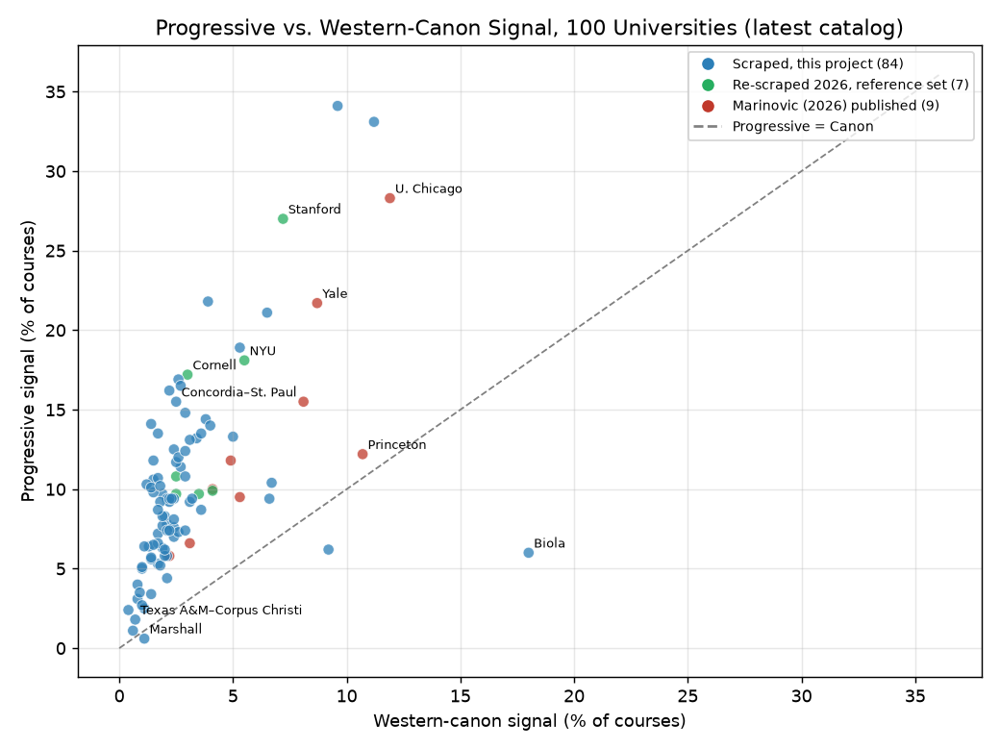
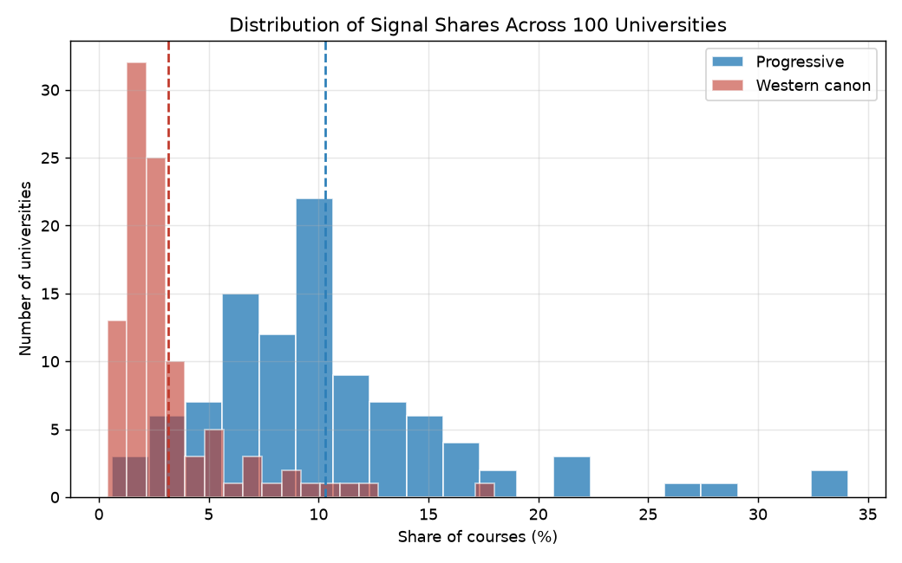
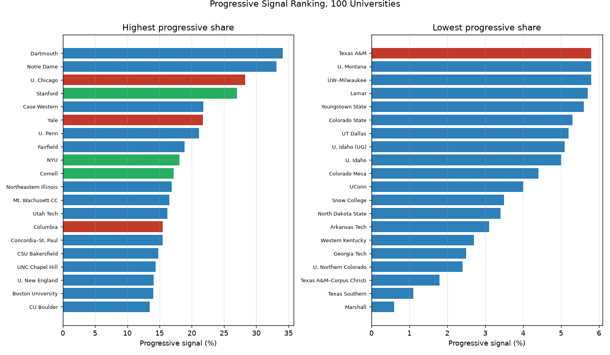
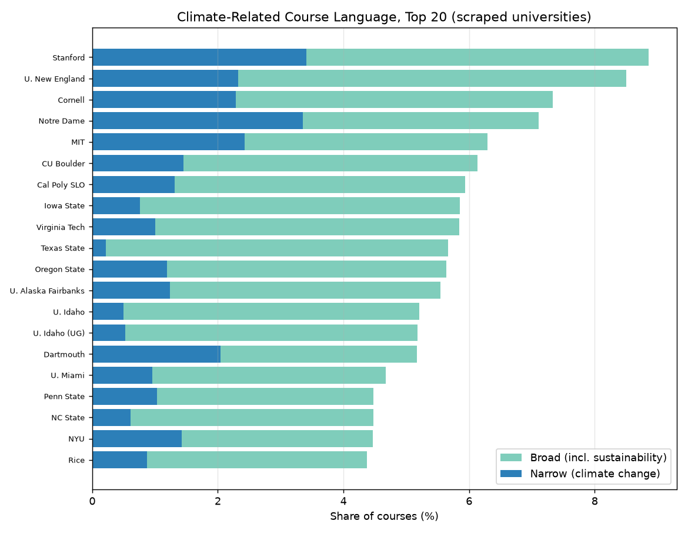

# What 100 Universities (Say They) Teach

### A cross-sectional extension of Marinovic (2026) to 100 U.S. institutions

*Generated automatically by the catalog-collection routine — June 2026*

---

## Abstract

This report extends the catalog-language analysis of Marinovic (2026), *What Universities (Say They) Teach*, from its original 16-university comparison set to **100 U.S. institutions**. Following the reference methodology, each course title and description is searched for two keyword families: a **progressive signal** (race, gender, identity, diversity, equity, social justice, decolonial, and related themes) and a **Western-canon signal** (classical antiquity, the Western intellectual tradition, canonical authors and texts). The sample combines **91 freshly collected catalogs** — 84 regional, public, and private institutions plus **7 of the original reference universities re-scraped from their current 2026 catalogs** (Stanford, MIT, Cornell, Northwestern, NYU, UIUC, U. Iowa) — with the remaining **9** reference universities cited from Marinovic (2026) because their catalogs are dynamic-JS or proxy-blocked. Across the 91 collected catalogs — **497,529 deduplicated courses** — the course-weighted progressive signal is **10.9%** and the Western-canon signal is **3.0%**. The central pattern of the original paper holds: the progressive signal exceeds the Western-canon signal at **97 of 100** institutions, typically by a factor of three to four. The signal is far from uniform — progressive shares range from under 1% to over 27% — and the few institutions where the canon signal dominates are Christian colleges or low-signal outliers. These measures are mechanical keyword counts, not judgments about course quality or what is taught in classrooms.

---

## 1. Introduction

Marinovic (2026) measures how often U.S. university course catalogs use language associated with progressive themes versus the Western canon, documenting a steady rise in the progressive signal alongside a flat-to-declining canon signal. That study draws its cross-sectional comparisons from sixteen major research universities. This report keeps the method fixed and asks a simpler question: **what does the same measurement look like across a much wider slice of American higher education?**

The 100 institutions here are deliberately heterogeneous. They include private research universities, large public flagships, regional public universities, technical institutes, religious colleges, and community colleges. This breadth is the point: the original sample explicitly omitted "community colleges, regional public universities, and most liberal-arts colleges," and this extension fills in exactly those gaps. Where the original reference catalogs could be reached, they were re-scraped directly (§4.4); where they could not, the published figures are carried over.

As in the reference report, this is a descriptive exercise. It does not judge the quality of individual courses or the seriousness of any field. It asks only how often certain themes appear in the official language by which universities describe their courses.

---

## 2. Data and Method

**Coverage.** The report combines two kinds of evidence:

- **91 freshly collected catalogs** scraped from each institution's current public catalog (almost all 2026–2027) and parsed into the common schema below. This includes 84 regional/public/private institutions plus **7 of the original reference universities** (Stanford via the ExploreCourses XML API; MIT, Northwestern, NYU, UIUC, and U. Iowa via their CourseleafCMS catalogs; Cornell via the Class Roster API). Together these contain **497,529 deduplicated courses**.
- **9 reference catalogs** carried over from Marinovic (2026) — UC Berkeley, Harvard, Yale, Princeton, U. Chicago, Columbia, Vanderbilt, UT Austin, and Texas A&M — whose public catalogs are dynamic-JS single-page apps or are blocked from the collection environment and could not be re-scraped. Their latest-year shares are reproduced from Table 6 of that paper.

**Keyword matching.** Matching is case-insensitive substring matching against the same progressive and Western-canon keyword lists used throughout this project (reproduced in `schema.md`, and themselves drawn from Tables 2–3 of the reference paper). A course carries a signal if its combined title-plus-description contains at least one keyword from the corresponding list. Cross-listed duplicates are collapsed to one course-year before any share is computed. The two signals are not mutually exclusive.

**Caveats specific to this extension:**

1. **Single-year snapshot.** The collected catalogs are observed in a single recent catalog year, so this is a cross-section, not a panel; it cannot speak to trends over time.
2. **Coarser area classification.** Broad academic areas are assigned by a mechanical department/title keyword map, so the residual **"Other"** category is large and should be read as "unclassified."
3. **Full catalog, no enrollment weights.** All shares are unweighted course counts over the full published catalog. The reference paper's headline figures instead restrict to *offered and enrollment-observed* courses and use word-boundary matching, so re-scraped values here run systematically higher than the paper's published numbers (quantified in §4.4).

---

## 3. Headline Findings

- **The progressive signal dominates the canon signal almost everywhere.** At **97 of 100** institutions the progressive share exceeds the Western-canon share. Across the 91 collected catalogs the course-weighted progressive signal (10.9%) is about **3.6×** the canon signal (3.0%).
- **Typical magnitudes are well below the elite tail.** The median institution carries the progressive signal on **9.4%** of courses and the canon signal on **2.2%**. The simple mean across all 100 is **10.3%** progressive and **3.2%** canon. The most progressive catalogs — Stanford and the elite privates — sit in the upper tail, not at the center.
- **Enormous dispersion.** Progressive shares span roughly **0.6% to 27%** (standard deviation 6.1 points). The spread is institutional, not just disciplinary: regional and technical schools cluster low, while research universities and several small private colleges cluster high.
- **Where the canon wins, it is usually religious.** Only three institutions carry more canonical than progressive language: Biola and Cornerstone — both Christian colleges where biblical and classical-author keywords are common — and Marshall, an outlier whose unusually low progressive share (0.6%) reflects short, sparse catalog descriptions.
- **Climate language is modest but pervasive.** Across collected catalogs the narrow climate signal averages **0.6%** of courses and the broad climate-or-sustainability signal **3.1%**.

*Figure 1. Each point is one institution's latest catalog. Points above the dashed line carry more progressive than canonical language. Blue = the 84 regional/public/private catalogs; green = the 7 re-scraped 2026 reference catalogs; red = the 9 reference catalogs still cited from Marinovic (2026).*

*Figure 2. Distribution of progressive and Western-canon shares across all 100 institutions. Dashed lines mark the means.*

---

## 4. Cross-Sectional Comparison (all 100 institutions)

Table 1 reports every institution's latest-catalog progressive and Western-canon shares, the ratio between them, and the number of courses analyzed. As in Table 6 of the reference paper, institutions are sorted from the highest progressive-to-canon ratio to the lowest. The Source column marks each row as `scraped` (this project), `re-scrape` (a reference university re-scraped from its 2026 catalog), or `paper` (carried over from Marinovic 2026).

| # | University | Year | Courses | Progressive % | Canon % | Prog./Canon | Source |
|--:|------------|:----:|--------:|:------------:|:-------:|:-----------:|--------|
| 1 | U. New England | 2026 | 2,070 | 14.1 | 1.4 | 10.07 | scraped |
| 2 | Oregon State | 2026 | 8,469 | 10.3 | 1.2 | 8.58 | scraped |
| 3 | Alverno | 2026 | 1,044 | 13.5 | 1.7 | 7.94 | scraped |
| 4 | Worcester State | 2026 | 1,767 | 11.8 | 1.5 | 7.87 | scraped |
| 5 | Utah Tech | 2026 | 2,117 | 16.2 | 2.2 | 7.36 | scraped |
| 6 | U. Northern Iowa | 2026 | 1,750 | 10.1 | 1.4 | 7.21 | scraped |
| 7 | Northeastern | 2026 | 7,966 | 10.6 | 1.5 | 7.07 | scraped |
| 8 | Cal Poly SLO | 2026 | 4,210 | 9.8 | 1.5 | 6.53 | scraped |
| 9 | Northeastern Illinois | 2026 | 3,558 | 16.9 | 2.6 | 6.50 | scraped |
| 10 | UW–Eau Claire | 2026 | 2,998 | 10.7 | 1.7 | 6.29 | scraped |
| 11 | Concordia–St. Paul | 2026 | 1,575 | 15.5 | 2.5 | 6.20 | scraped |
| 12 | Mt. Wachusett CC | 2026 | 448 | 16.5 | 2.7 | 6.11 | scraped |
| 13 | U. Northern Colorado | 2026 | 3,304 | 2.4 | 0.4 | 6.00 | scraped |
| 14 | Illinois Tech | 2026 | 3,221 | 6.4 | 1.1 | 5.82 | scraped |
| 15 | Cornell | 2026 | 4,459 | 17.2 | 3.0 | 5.73 | re-scrape |
| 16 | UW–Platteville | 2026 | 1,195 | 10.2 | 1.8 | 5.67 | scraped |
| 17 | Case Western | 2026 | 5,466 | 21.8 | 3.9 | 5.59 | scraped |
| 18 | U. Wisconsin–Madison | 2026 | 10,142 | 12.5 | 2.4 | 5.21 | scraped |
| 19 | UW–Green Bay | 2026 | 1,340 | 8.7 | 1.7 | 5.12 | scraped |
| 20 | U. Louisville | 2026 | 6,470 | 9.7 | 1.9 | 5.11 | scraped |
| 21 | U. Alaska Fairbanks | 2026 | 3,794 | 9.2 | 1.8 | 5.11 | scraped |
| 22 | U. Idaho (UG) | 2026 | 4,946 | 5.1 | 1.0 | 5.10 | scraped |
| 23 | CSU Bakersfield | 2026 | 2,461 | 14.8 | 2.9 | 5.10 | scraped |
| 24 | UConn | 2026 | 7,067 | 4.0 | 0.8 | 5.00 | scraped |
| 25 | U. Idaho | 2026 | 5,160 | 5.0 | 1.0 | 5.00 | scraped |
| 26 | Drexel | 2026 | 8,329 | 6.4 | 1.3 | 4.92 | scraped |
| 27 | U. Maryland | 2026 | 9,235 | 11.7 | 2.5 | 4.68 | scraped |
| 28 | Temple | 2026 | 12,782 | 12.0 | 2.6 | 4.62 | scraped |
| 29 | UT San Antonio | 2026 | 5,867 | 9.4 | 2.1 | 4.48 | scraped |
| 30 | Virginia Tech | 2026 | 7,685 | 9.3 | 2.1 | 4.43 | scraped |
| 31 | Virginia State | 2026 | 2,333 | 8.3 | 1.9 | 4.37 | scraped |
| 32 | Montana State | 2026 | 4,443 | 6.5 | 1.5 | 4.33 | scraped |
| 33 | U. Iowa | 2026 | 9,137 | 10.8 | 2.5 | 4.32 | re-scrape |
| 34 | Texas State | 2026 | 5,980 | 12.4 | 2.9 | 4.28 | scraped |
| 35 | Keene State | 2026 | 1,006 | 9.4 | 2.2 | 4.27 | scraped |
| 36 | Iowa State | 2026 | 8,242 | 7.2 | 1.7 | 4.24 | scraped |
| 37 | U. Kansas | 2026 | 8,495 | 13.1 | 3.1 | 4.23 | scraped |
| 38 | U. Washington | 2026 | 15,673 | 11.4 | 2.7 | 4.22 | scraped |
| 39 | UNC Greensboro | 2026 | 5,890 | 9.2 | 2.2 | 4.18 | scraped |
| 40 | UT Arlington | 2026 | 7,016 | 8.3 | 2.0 | 4.15 | scraped |
| 41 | UAB | 2026 | 3,556 | 9.4 | 2.3 | 4.09 | scraped |
| 42 | Lamar | 2026 | 2,346 | 5.7 | 1.4 | 4.07 | scraped |
| 43 | Old Dominion | 2026 | 7,543 | 7.7 | 1.9 | 4.05 | scraped |
| 44 | Youngstown State | 2026 | 4,345 | 5.6 | 1.4 | 4.00 | scraped |
| 45 | U. Missouri | 2026 | 11,338 | 9.4 | 2.4 | 3.92 | scraped |
| 46 | Snow College | 2026 | 1,150 | 3.5 | 0.9 | 3.89 | scraped |
| 47 | UIUC | 2026 | 9,439 | 9.7 | 2.5 | 3.88 | re-scrape |
| 48 | Penn State | 2026 | 14,505 | 13.2 | 3.4 | 3.88 | scraped |
| 49 | Mississippi State | 2026 | 3,346 | 6.6 | 1.7 | 3.88 | scraped |
| 50 | Arkansas Tech | 2026 | 2,794 | 3.1 | 0.8 | 3.88 | scraped |
| 51 | UNC Chapel Hill | 2026 | 10,664 | 14.4 | 3.8 | 3.79 | scraped |
| 52 | Stanford | 2026 | 15,668 | 27.0 | 7.2 | 3.75 | re-scrape |
| 53 | CU Boulder | 2026 | 9,232 | 13.5 | 3.6 | 3.75 | scraped |
| 54 | Tulane | 2026 | 8,960 | 10.8 | 2.9 | 3.72 | scraped |
| 55 | U. Oregon | 2026 | 6,007 | 7.8 | 2.1 | 3.71 | scraped |
| 56 | Fairfield | 2026 | 2,631 | 18.9 | 5.3 | 3.57 | scraped |
| 57 | Dartmouth | 2026 | 4,116 | 34.1 | 9.6 | 3.55 | scraped |
| 58 | Utah Valley | 2026 | 4,292 | 7.4 | 2.1 | 3.52 | scraped |
| 59 | Boston University | 2026 | 3,564 | 14.0 | 4.0 | 3.50 | scraped |
| 60 | NC State | 2026 | 7,761 | 8.1 | 2.4 | 3.38 | scraped |
| 61 | Washburn | 2026 | 2,746 | 7.4 | 2.2 | 3.36 | scraped |
| 62 | Oklahoma State | 2026 | 7,551 | 6.3 | 1.9 | 3.32 | scraped |
| 63 | NYU | 2026 | 16,829 | 18.1 | 5.5 | 3.29 | re-scrape |
| 64 | U. Penn | 2026 | 0 | 21.1 | 6.5 | 3.25 | scraped |
| 65 | U. Nebraska–Lincoln | 2026 | 9,954 | 7.6 | 2.4 | 3.17 | scraped |
| 66 | Colorado State | 2026 | 4,048 | 5.3 | 1.7 | 3.12 | scraped |
| 67 | Sam Houston State | 2026 | 1,966 | 6.2 | 2.0 | 3.10 | scraped |
| 68 | U. Alabama | 2026 | 6,641 | 9.2 | 3.1 | 2.97 | scraped |
| 69 | Notre Dame | 2026 | 9,536 | 33.1 | 11.2 | 2.96 | scraped |
| 70 | Texas A&M International | 2026 | 1,990 | 9.4 | 3.2 | 2.94 | scraped |
| 71 | George Washington | 2026 | 7,827 | 7.0 | 2.4 | 2.92 | scraped |
| 72 | UW–Milwaukee | 2026 | 7,006 | 5.8 | 2.0 | 2.90 | scraped |
| 73 | UT Dallas | 2026 | 5,121 | 5.2 | 1.8 | 2.89 | scraped |
| 74 | U. Miami | 2026 | 9,882 | 7.3 | 2.6 | 2.81 | scraped |
| 75 | MIT | 2026 | 5,918 | 9.7 | 3.5 | 2.77 | re-scrape |
| 76 | U. Montana | 2026 | 4,400 | 5.8 | 2.1 | 2.76 | scraped |
| 77 | Western Kentucky | 2026 | 3,083 | 2.7 | 1.0 | 2.70 | scraped |
| 78 | Rice | 2026 | 6,470 | 13.3 | 5.0 | 2.66 | scraped |
| 79 | Texas A&M | 2024 | 50,135* | 5.8 | 2.2 | 2.64 | paper |
| 80 | Texas A&M–Corpus Christi | 2026 | 2,043 | 1.8 | 0.7 | 2.57 | scraped |
| 81 | U. Nebraska–Kearney | 2026 | 2,667 | 7.4 | 2.9 | 2.55 | scraped |
| 82 | Yale | 2025 | 35,205* | 21.7 | 8.7 | 2.49 | paper |
| 83 | UC Berkeley | 2025 | 191,558* | 10.0 | 4.1 | 2.44 | paper |
| 84 | North Dakota State | 2026 | 5,596 | 3.4 | 1.4 | 2.43 | scraped |
| 85 | U. Florida | 2026 | 4,929 | 8.7 | 3.6 | 2.42 | scraped |
| 86 | Northwestern | 2026 | 1,715 | 9.9 | 4.1 | 2.41 | re-scrape |
| 87 | Vanderbilt | 2025 | 58,999* | 11.8 | 4.9 | 2.41 | paper |
| 88 | U. Chicago | 2024 | 21,381* | 28.3 | 11.9 | 2.38 | paper |
| 89 | Georgia Tech | 2026 | 5,332 | 2.5 | 1.1 | 2.27 | scraped |
| 90 | UT Austin | 2025 | 47,739* | 6.6 | 3.1 | 2.13 | paper |
| 91 | Colorado Mesa | 2026 | 2,985 | 4.4 | 2.1 | 2.10 | scraped |
| 92 | Columbia | 2025 | 24,674* | 15.5 | 8.1 | 1.91 | paper |
| 93 | Texas Southern | 2026 | 2,065 | 1.1 | 0.6 | 1.83 | scraped |
| 94 | Harvard | 2025 | 120,567* | 9.5 | 5.3 | 1.79 | paper |
| 95 | Vanguard | 2026 | 1,368 | 10.4 | 6.7 | 1.55 | scraped |
| 96 | George Mason | 2026 | 8,248 | 9.4 | 6.6 | 1.42 | scraped |
| 97 | Princeton | 2025 | 24,118* | 12.2 | 10.7 | 1.14 | paper |
| 98 | Cornerstone | 2026 | 1,276 | 6.2 | 9.2 | 0.67 | scraped |
| 99 | Marshall | 2026 | 3,216 | 0.6 | 1.1 | 0.55 | scraped |
| 100 | Biola | 2026 | 2,754 | 6.0 | 18.0 | 0.33 | scraped |

*\* For the 9 paper-only institutions the course count is the total course-years in Marinovic (2026), not a single-year count; their shares are latest-year (2024/2025) values from that paper. Collected course counts are deduplicated single-year (mostly 2026–2027).*

*Figure 3. The twenty highest and twenty lowest institutions by progressive share.*

### 4.4 Re-scraped reference universities: 2026 catalog vs. published figures

Seven of the sixteen original reference universities could be re-scraped from their live 2026 catalogs. Table 2 places the freshly scraped shares next to the values Marinovic (2026) reported. The re-scraped numbers are consistently higher, for two structural reasons. First, this project scrapes the **entire published catalog**, whereas the paper restricts its headline shares to courses that were actually *offered and had observed enrollment* — a smaller, less seminar-heavy population. Second, this project uses **substring matching** while the paper uses **word-boundary matching**. Both effects push the same direction. The gap is therefore a methodological artifact, not evidence that these catalogs changed dramatically between the paper's year and 2026; the *relative ordering* is largely preserved.

| University | 2026 re-scrape Prog % | Paper Prog % | 2026 re-scrape Canon % | Paper Canon % | 2026 courses |
|------------|:--------------------:|:------------:|:----------------------:|:-------------:|:------------:|
| Stanford | 27.0 | 14.3 | 7.2 | 4.2 | 15,668 |
| NYU | 18.1 | 15.7 | 5.5 | 11.9 | 16,829 |
| Cornell | 17.2 | 15.3 | 3.0 | 4.4 | 4,459 |
| U. Iowa | 10.8 | 8.3 | 2.5 | 2.4 | 9,137 |
| Northwestern | 9.9 | 9.1 | 4.1 | 3.2 | 1,715 |
| UIUC | 9.7 | 6.5 | 2.5 | 1.9 | 9,439 |
| MIT | 9.7 | 7.8 | 3.5 | 3.7 | 5,918 |

Note: Northwestern is the undergraduate catalog only (the paper covers the full university); its course count is correspondingly smaller.

---

## 5. Catalog Composition

Universities differ mechanically in the mix of courses they offer, which shapes baseline exposure to each keyword list. Table 3 aggregates the broad-area composition across the 91 collected catalogs. The large **Other** share reflects the coarse, keyword-based area classifier used in this extension (see §2) and should be read as "unclassified."

| Broad area | Courses | Share of collected catalog |
|------------|--------:|:--------------------------:|
| Humanities | 89,871 | 17.8% |
| Social Sciences | 48,469 | 9.6% |
| STEM | 85,562 | 16.9% |
| Medical Sciences | 19,251 | 3.8% |
| Professional | 42,250 | 8.4% |
| Other | 220,418 | 43.6% |
| **Total** | **505,821** | **100.0%** |

In the reference paper the progressive signal is concentrated in the Social Sciences and Professional schools, the Western-canon signal in the Humanities, and both are lowest in STEM. The institution-level results below are consistent with that pattern: the catalogs with the highest progressive shares are the humanities- and social-science-heavy private colleges and flagships, while the lowest are the technical and applied institutions.

---

## 6. Climate-Related Language

Following Appendix C of the reference paper, climate language is measured separately from the progressive signal because it is not a synonym for it. Two definitions are used: a **narrow** signal (climate change, global warming, greenhouse gas, carbon emissions, and similar) and a **broad** signal that adds sustainability, renewable energy, and clean energy. Across the collected catalogs the narrow signal averages **0.6%** of courses and the broad signal **3.1%**.

*Figure 4. The twenty collected institutions with the highest broad climate-or-sustainability share. Dark bars show the narrow climate-change signal within each.*

| # | University | Narrow climate % | Broad climate % |
|--:|------------|:----------------:|:---------------:|
| 1 | Stanford | 3.4 | 8.9 |
| 2 | U. New England | 2.3 | 8.5 |
| 3 | Cornell | 2.3 | 7.3 |
| 4 | Notre Dame | 3.4 | 7.1 |
| 5 | MIT | 2.4 | 6.3 |
| 6 | CU Boulder | 1.4 | 6.1 |
| 7 | Cal Poly SLO | 1.3 | 5.9 |
| 8 | Iowa State | 0.8 | 5.8 |
| 9 | Virginia Tech | 1.0 | 5.8 |
| 10 | Texas State | 0.2 | 5.7 |
| 11 | Oregon State | 1.2 | 5.6 |
| 12 | U. Alaska Fairbanks | 1.2 | 5.5 |
| 13 | U. Idaho | 0.5 | 5.2 |
| 14 | U. Idaho (UG) | 0.5 | 5.2 |
| 15 | Dartmouth | 2.0 | 5.2 |

---

## 7. Limitations

- **Catalogs are not classrooms.** Keyword counts on public course descriptions do not reveal what is assigned, how a course is taught, or what students learn.
- **Keyword lists are imperfect.** Substring matching produces false positives (e.g. *race* in "race car," *equity* in finance, *classical* in physics) and false negatives (themes discussed without the listed words). This matters most for the full-catalog re-scrapes in §4.4.
- **Population and matching differences.** The re-scraped reference values are not directly comparable to the paper's published figures (full catalog + substring here vs. offered-subset + word-boundary there); they ARE comparable to the other collected catalogs in this report.
- **Uneven coverage.** Nine reference universities could not be re-scraped and retain paper values; Northwestern is undergraduate-only; per-institution scrape failures are recorded in each `data/<uni>/<uni>_summary.json`.

---

## 8. Conclusion

Extending the catalog-language measurement from 16 to 100 institutions — and re-scraping seven of the original reference universities from their 2026 catalogs — does not overturn the central finding of Marinovic (2026): progressive language is far more common than Western-canon language in the stated curriculum, dominating at 97 of 100 schools. What the wider sample adds is **context for magnitude**. The very high progressive shares that characterize the most-discussed elite catalogs are not representative of American higher education as a whole; the median institution sits near 9%, and a long tail of regional, technical, and religious institutions sits well below that. The institutions where the canon still leads are a small and distinctive group — Christian colleges, plus one low-signal outlier. As in the original, these are rough, comparable signals rather than precise estimates, offered for transparency and replication rather than as verdicts on any institution.

---

## Appendix: Data and Reproduction

- **Institutions:** 100 total — 91 freshly collected (84 this project + 7 re-scraped reference) and 9 carried over from Marinovic (2026).
- **Courses analyzed (collected):** 497,529 deduplicated course records.
- **Per-institution data:** `data/<uni>/<uni>_<year>.csv` (full records) and `data/<uni>/<uni>_summary.json` (signal shares, area composition, failed departments).
- **Re-scrape script:** `scripts/scrape_reference16.py`. **Report build:** `scripts/build_report_*.py`. **Catalog status of all targets:** `progress.json`. **Keyword lists and schema:** `schema.md`. **Figures:** `reports/figures/`.

*Reference: Ivan Marinovic, "What Universities (Say They) Teach," Stanford University, June 2026.*
